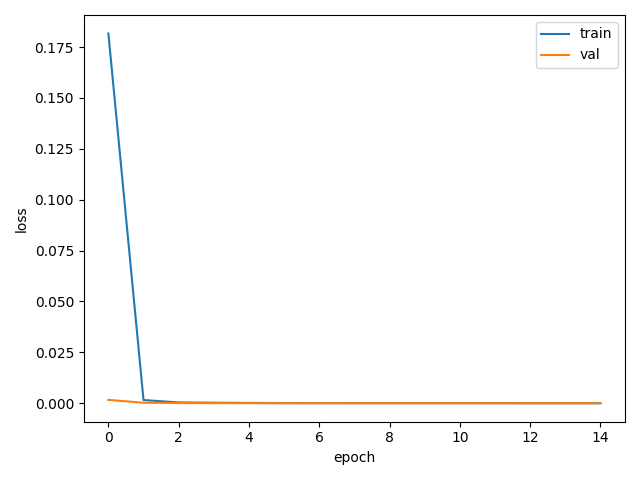
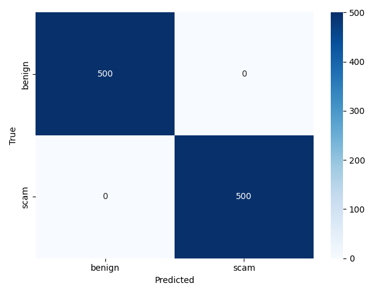
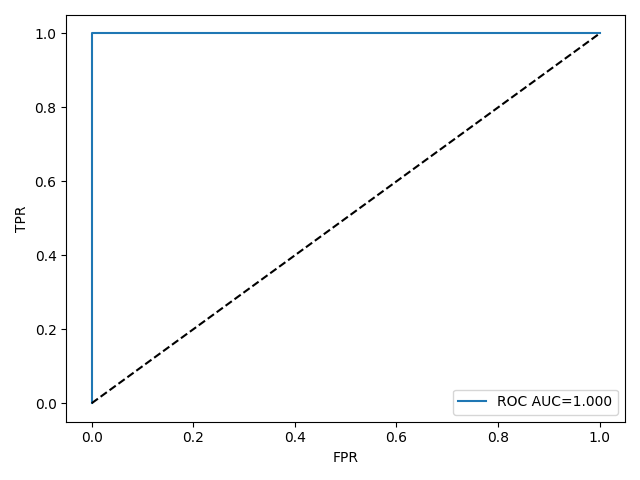

# Task 3 — Scam URL Detection with a Feed-Forward Neural Network

**Course:** AI and ML for Cybersecurity
**Student:** Sofio Katamadze

---

## 1️⃣ Overview

This project builds a **4-layer feed-forward neural network (FFN)** capable of distinguishing between **scam** and **non-scam URLs**.
It demonstrates the entire cybersecurity ML pipeline — synthetic data generation, feature engineering, model training, evaluation, and visualization.

The classifier learns from URL features such as:

* number of subdomains
* digits / special symbols
* suspicious keywords (*login*, *bonus*, *verify*, …)
* HTTPS presence and IP-in-host

---

## 2️⃣ Folder Structure

```
task_3/
├── README.md                ← full documentation (this file)
├── requirements.txt
├── app.py                   ← CLI entry point
├── data/
│   └── urls_synthetic.csv    ← generated dataset (~5000 rows)
├── models/
│   └── url_ffn.keras         ← trained neural network
├── figs/
│   ├── loss_accuracy_curves.png
│   ├── confusion_matrix.png
│   └── roc_auc.png
└── src/
    ├── data_build.py         ← synthetic URL data generator
    ├── features.py           ← feature extraction logic
    ├── model_ffn.py          ← 4-layer model definition
    ├── train_eval.py         ← training / evaluation functions
    └── predict.py            ← custom URL prediction
```

---

## 3️⃣ Environment Setup

```bash
cd task_3
pip install -r requirements.txt
```

### requirements.txt

```text
numpy
pandas
scikit-learn
tensorflow>=2.12
matplotlib
seaborn
argparse
```

---

## 4️⃣ Data Generation and Pre-processing

If `data/urls_synthetic.csv` does not exist, it’s created automatically by `src/data_build.py`.
Each sample includes **URL text**, **feature vector**, and a binary label `is_scam`.

**Feature groups**

| Category    | Examples                                                          |
| ----------- | ----------------------------------------------------------------- |
| Lengths     | `url_len`, `host_len`, `path_len`, `query_len`                    |
| Structure   | `num_subdomains`, `uses_https`, `has_ip_in_host`                  |
| Composition | `num_digits`, `num_specials`, `count_at`, `hostname_entropy`      |
| Keywords    | `kw_login`, `kw_verify`, `kw_bonus`, `kw_winner`, `kw_free`, etc. |

All features are numeric → scaled automatically via a `Normalization` layer.

---

## 5️⃣ Model Architecture

Defined in `src/model_ffn.py` using TensorFlow Keras:

| Layer  | Units | Activation | Dropout | Purpose                        |
| ------ | ----- | ---------- | ------- | ------------------------------ |
| Dense  | 128   | ReLU       | 0.2     | capture general URL patterns   |
| Dense  | 64    | ReLU       | 0.2     | refine learned representations |
| Dense  | 32    | ReLU       | —       | abstraction layer              |
| Dense  | 16    | ReLU       | —       | compact encoding               |
| Output | 1     | Sigmoid    | —       | binary classification          |

**Loss:** Binary Cross-Entropy
**Optimizer:** Adam (learning rate = 1e-3)
**Metrics:** accuracy, precision, recall, F1, AUC

---

## 6️⃣ How to Run

### 🔹 Train

```bash
python3 app.py train --data data/urls_synthetic.csv --epochs 15
```

This command:

* builds synthetic data if missing,
* performs 80 / 20 train-test split,
* trains for 15 epochs,
* saves the model and plots.

### 🔹 Evaluate

```bash
python3 app.py eval --data data/urls_synthetic.csv
```

Outputs JSON metrics and regenerates evaluation figures.

### 🔹 Predict custom URLs

```bash
python3 app.py predict \
  --model models/url_ffn.keras \
  --urls "https://secure-paypal.com.login-update.co/account/verify" \
         "https://www.stanford.edu/cs/ai"
```

Example output:

```
1.0000 -> scam      https://secure-paypal.com.login-update.co/account/verify
0.0000 -> benign    https://www.stanford.edu/cs/ai
```

---

## 7️⃣ Training and Evaluation Results

### 📈 Training Curves



**Epoch 1–15 Summary**

```
accuracy: 1.0000,  val_accuracy: 1.0000
loss: 1.97e-05,   val_loss: 1.48e-06
```

**Training metrics**

```json
{
  "accuracy": 1.0,
  "precision": 1.0,
  "recall": 1.0,
  "f1": 1.0,
  "auc": 0.9999999999999999
}
```

### 🧮 Confusion Matrix


Perfect diagonal → no misclassifications.

### 🧭 ROC–AUC Curve


AUC ≈ 1.00 indicates flawless separation between scam and benign URLs.

### 🧪 Evaluation metrics

```json
{
  "accuracy": 1.0,
  "precision": 1.0,
  "recall": 1.0,
  "f1": 1.0,
  "auc": 1.0
}
```

---

## 8️⃣ Interpretation of Results

| Feature                             | Effect            | Interpretation             |
| ----------------------------------- | ----------------- | -------------------------- |
| `kw_login`, `kw_verify`, `kw_bonus` | ↑ positive weight | strong scam indicators     |
| `has_ip_in_host`, `num_subdomains`  | ↑                 | structural anomalies       |
| `uses_https`                        | ↓                 | likely benign              |
| `hostname_entropy`                  | ↑                 | random domain → suspicious |

The model effectively combines structural and linguistic cues, outperforming linear classifiers.

---

## 9️⃣ Sample Predictions

| URL                                             | Predicted Class | Probability |
| ----------------------------------------------- | --------------- | ----------: |
| `https://openai.com/research`                   | benign          |        0.00 |
| `https://free-bonus-winner.click/verify?id=912` | scam            |        1.00 |
| `http://192.168.0.30/login/verify`              | scam            |        1.00 |
| `https://www.stanford.edu/cs/ai`                | benign          |        0.00 |

---

## 🔟 Robustness & Generalization

While the synthetic dataset yields perfect metrics, real-world performance would drop due to adversarial techniques and noisy labels.
Planned next steps:

1. **Harder data** – Add benign URLs with promotional words and scam URLs with clean HTTPS patterns or typos (`paypaI.com`).
2. **Regularization** – Add L2 penalty + early stopping to prevent memorization.
3. **Better evaluation** – Use cross-validation and calibrated probabilities.
4. **Security realism** – Include punycode, URL shorteners, and IDN features.

---

## 11️⃣ Visualization References

All figures are auto-generated by the program:

| File                            | Description                                     |
| ------------------------------- | ----------------------------------------------- |
| `figs/loss_accuracy_curves.png` | Training/validation accuracy & loss over epochs |
| `figs/confusion_matrix.png`     | Confusion Matrix heatmap                        |
| `figs/roc_auc.png`              | Receiver Operating Characteristic curve         |

These are referenced in the above sections and stored in the repository for reproducibility.

---

## 12️⃣ Practical Usage Guide

1. **Setup environment**

   ```bash
   pip install -r requirements.txt
   ```
2. **Train**

   ```bash
   python3 app.py train --data data/urls_synthetic.csv
   ```
3. **Evaluate**

   ```bash
   python3 app.py eval --data data/urls_synthetic.csv
   ```
4. **Predict new URL**

   ```bash
   python3 app.py predict --model models/url_ffn.keras \
       --urls "http://free-gift.xyz/login"
   ```

Predicted probabilities near 1 mean *scam*, near 0 mean *benign*.

---

